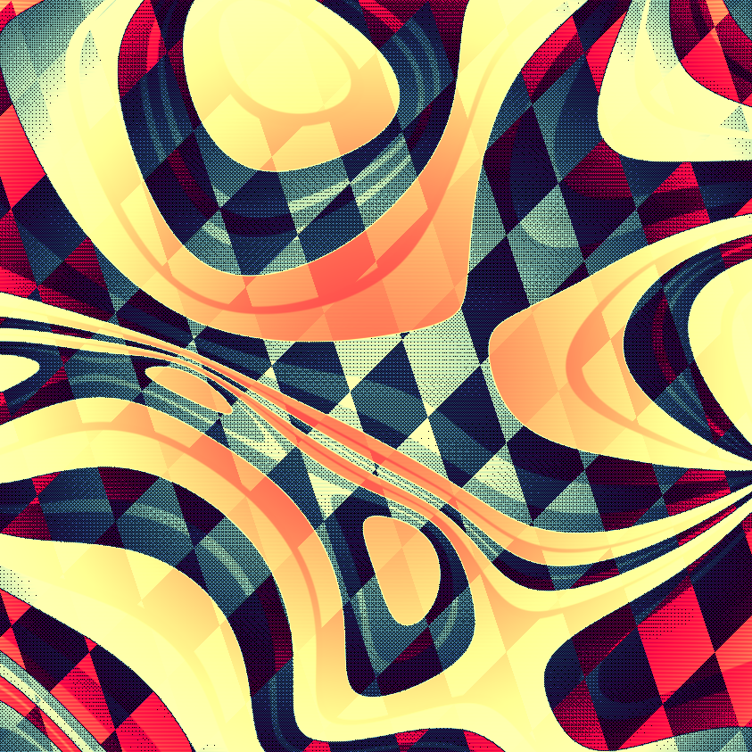
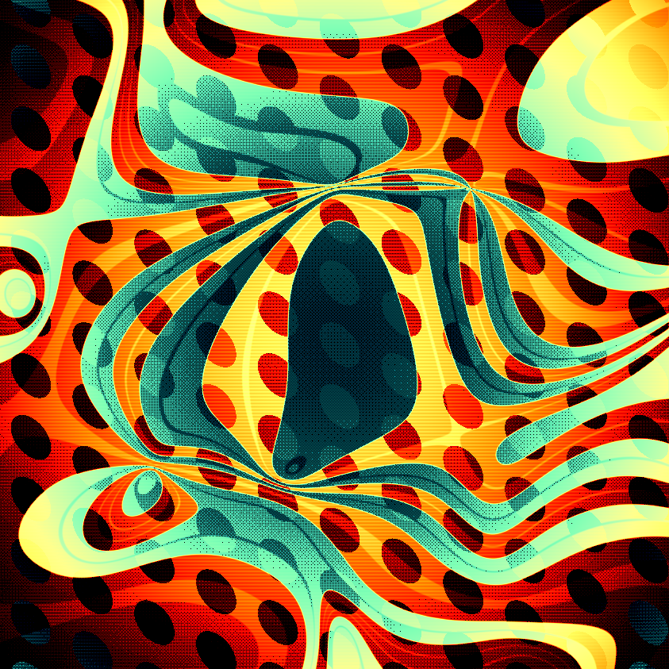
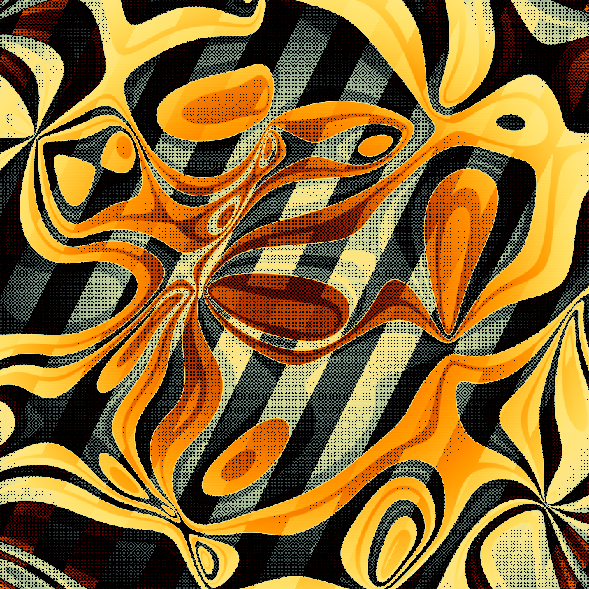
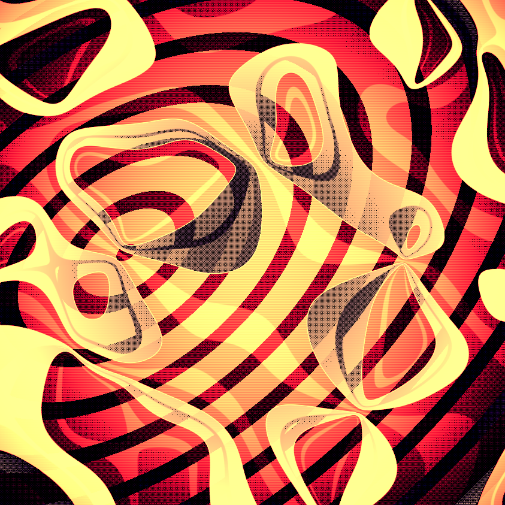

## About Haywire Café

### Overview
Haywire Café is a long-form generative art project designed by Jess Hewitt for Art Blocks. The combination of bold colors, distorted patterns, and dramatic shadows create a surreal, nostalgic vibe.  

### Inspiration
This series is inspired by classic mind-bending mid century cartoons by the likes of Chuck Jones, Maurice Noble, and Dr. Seuss. These cartoons shaped my sense of style with their exaggerated perspective, smart humor, and breaking of the fourth wall.

 
 

### Process
My creative process often involves an element of discovery and intuitive curation. I've co-written a generative art app that I sometimes use to find that beginning direction. I'll randomize its settings and look for interesting output, which I will then develop and refine.  

Haywire Café was conceived in this way, and then replicated in standalone form and fine-tuned.  

The process of generating these works is described below. The steps are seemingly simple, but the magic happens in the pattern mixing and in the order of operations.  

You'll notice that it looks quite different before the palette is applied!

1. Generate a distorted background pattern
The pattern can be one of bubbles, checkers, circle, dots, grid, rings or stripes and is controlled by the `Pattern` feature. The distortion comes from the `Pattern Rotation` and `Pattern Skew` features.

2. Generate some curl noise
The curl noise creates the loopy, bandy foreground forms. It's controlled by the `Loop Scale` feature (smaller is more noodly) as well as a few hidden variables.

3. Mix the two together
When the two are combined, the curl noise develops a hard edge and outline which becomes more visible later. The edge is controlled by a hidden variable. This process also creates the appearance of dramatic shadows after the palette is applied.

4. Add some post processing
Technically, this is pre-processing...scanlines and an inverted vignette are applied before the palette instead of at the end.

5. Apply a palette
One of 21 palettes is applied, controlled by the `Palette` feature. 

6. Apply dithering
Bayer 8x8 dithering is applied to create an interesting regular yet grainy look. Rarely, dust speckles are also applied, controlled by the `Dusty` feature.

