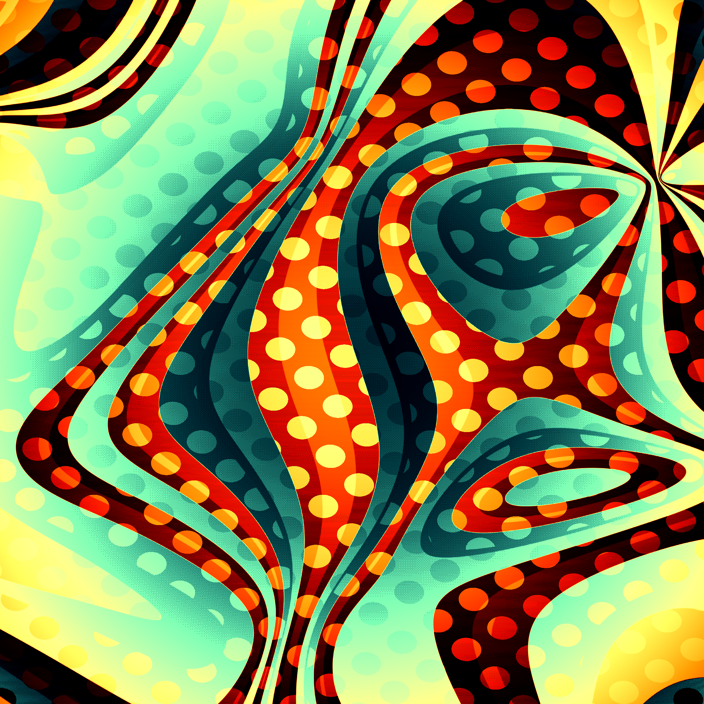
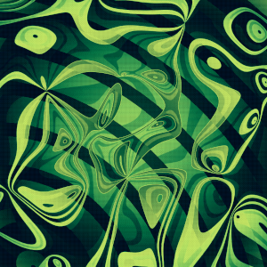

## Project Overview
Haywire Café is a long-form generative art project designed for Art Blocks. The combination of bold colors, distorted patterns, and dramatic shadows creates a surreal, nostalgic vibe.  

## Inspiration
This series is inspired by classic mind-bending mid century cartoons by the likes of Chuck Jones, Maurice Noble, and Dr. Seuss. These cartoons shaped my sense of style with their exaggerated perspective, smart humor, and breaking of the fourth wall.

 
 

## Process
My creative process often involves an element of discovery and intuitive curation. I've co-written a generative art app that I sometimes use to find that beginning direction. I'll randomize its settings and look for interesting output, which I will then develop and refine.  

Haywire Café was conceived in this way, and then replicated in standalone form and fine-tuned.  

The process of generating these works is described below. It seems simple, but the magic happens in the method of pattern mixing and in the order of operations. Any small deviation from this formula creates a drastically different effect.  

### Generate a distorted background pattern  

The pattern can be one of bubbles, checkers, circle, dots, grid, rings or stripes and is controlled by the `Pattern` feature. The distortion is affected by the `Pattern Rotation` and `Pattern Skew` features.

### Generate some curl noise  

The curl noise creates the loopy, bandy foreground forms. It's controlled by the `Loop Scale` feature (smaller is more bandy) as well as a few hidden variables.

### Mix the two together  

When the two are combined, the curl noise develops a hard edge and outline which will become more visible later. This process also creates the appearance of dramatic shadows after the palette is applied.

### Add some effects 

Scanlines and an inverted vignette are applied here, rather than at the end, to allow for a specific distribution of the palette.

### Apply a palette  

One of 21 palettes is applied, controlled by the `Palette` feature. 

### Apply dithering  

Bayer 8x8 dithering is applied to create an interesting regular yet grainy look. Rarely, dust speckles are also applied, controlled by the `Dusty` feature.

## Summary
With this series, I endeavored to capture the optimistic, lighthearted and surreal mood of the most influential cartoons of my childhood. I hope that I've been successful in transporting you to another realm, and in honoring the masters of animation whose works were so deeply inspirational.